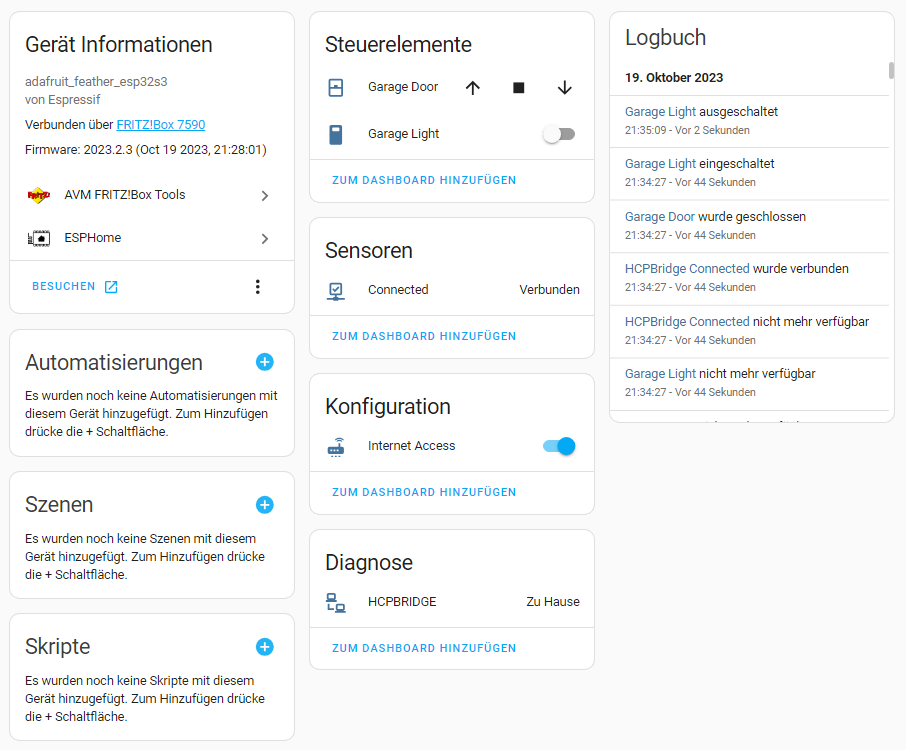

# esphome-hcpbridge

[](https://github.com/mapero/esphome-hcpbridge/blob/main/LICENSE)
[](https://github.com/mapero/esphome-hcpbridge)
[](https://github.com/sponsors/mapero)


This is a esphome-based adaption of the HCPBridge. Credits for the initial development of the HCPBridge go to [Gifford47](https://github.com/Gifford47/HCPBridgeMqtt), [hkiam](https://github.com/hkiam/HCPBridge) and all the other guys contributed.

## Usage

### Example esphome configuration

```YAML
esphome:
  name: hcpbridge
  libraries:
    - emelianov/modbus-esp8266 # Required for communication with the modbus
  platformio_options:
    board_build.f_cpu: 240000000L
    board_build.flash_mode: qio
    monitor_speed: 9600
    monitor_filters: esp32_exception_decoder
    lib_ldf_mode: deep+
    # board_build.f_flash: 40000000L

external_components:
    source: github://mapero/esphome-hcpbridge
    refresh: 0s # Ensure you always get the latest version

esp32:
  board: adafruit_feather_esp32s3
  framework:
    type: arduino

hcpbridge:
  is_connected: # Sensor to display the connection status to the motor
    name: "HCPBridge Connected"

cover:
  - platform: hcpbridge
    name: Garage Door

switch:
  - platform: hcpbridge
    name: Garage Light

# API to communicate with home assistant
api:
  encryption:
    key: !secret api_key

# Enable OTA updates
ota:
  safe_mode: true
```

### Home Assistant



### Cover

The component provides a cover component to control the garage door.

### Switch

The component provides a switch component to turn the light off and on.

### Services

Additionally, when using the cover component, you can use the following services:

- `esphome.hcpbridge_go_to_close`: To close the garage door
- `esphome.hcpbridge_go_to_half`: To move the garage door to half position
- `esphome.hcpbridge_go_to_vent`: To move the garage door to the vent position
- `esphome.hcpbridge_go_to_open`: To open the garage door

# Project

- HCPBridge from `Tysonpower` on an `Hörmann Promatic 4`

You can find more information on the project here: [Hörmann garage door via MQTT](https://community.home-assistant.io/t/hormann-garage-door-via-mqtt/279938/340)

# ToDo

- [x] Initial working version
- [ ] Use esphome modbus component instead of own code
- [ ] Map additional functions to esphome
- [ ] Use callbacks instead of pollingComponent
- [x] Expert options for the HCPBridge component (GPIOs ...)

# Contribute

I am open for contribution. Just get in contact with me.

# License

```
MIT License

Copyright (c) 2023 Jochen Scheib

Permission is hereby granted, free of charge, to any person obtaining a copy
of this software and associated documentation files (the "Software"), to deal
in the Software without restriction, including without limitation the rights
to use, copy, modify, merge, publish, distribute, sublicense, and/or sell
copies of the Software, and to permit persons to whom the Software is
furnished to do so, subject to the following conditions:

The above copyright notice and this permission notice shall be included in all
copies or substantial portions of the Software.

THE SOFTWARE IS PROVIDED "AS IS", WITHOUT WARRANTY OF ANY KIND, EXPRESS OR
IMPLIED, INCLUDING BUT NOT LIMITED TO THE WARRANTIES OF MERCHANTABILITY,
FITNESS FOR A PARTICULAR PURPOSE AND NONINFRINGEMENT. IN NO EVENT SHALL THE
AUTHORS OR COPYRIGHT HOLDERS BE LIABLE FOR ANY CLAIM, DAMAGES OR OTHER
LIABILITY, WHETHER IN AN ACTION OF CONTRACT, TORT OR OTHERWISE, ARISING FROM,
OUT OF OR IN CONNECTION WITH THE SOFTWARE OR THE USE OR OTHER DEALINGS IN THE
SOFTWARE.
```